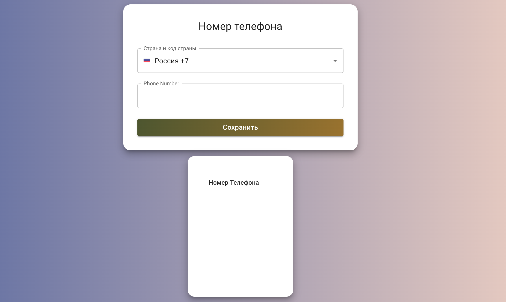

# The Project started with Create React App

## Available Scripts

In the project directory, you can run:

### `npm start`

### `npm test`

### `npm run build`

## This project used technologies such as React, Typescript, Redux(Redux.Toolkit), Material UI(v5), firebase

## First view of project

## Deploy

https://phone-number-2021.web.app/
