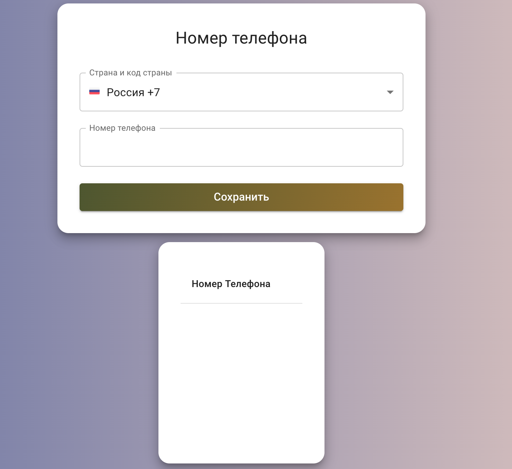

# The Project started with Create React App

## Available Scripts

In the project directory, you can run:

### `npm start`

### `npm test`

### `npm run build`

## This project used technologies such as React, Typescript, Redux(Redux.Toolkit), Material UI(v5), firebase

## First view of project

## Deploy

https://phone-number-2022j.web.app/  

__Task__

*  Implement a reactive web application to enter phone numbers and list the entered numbers in a table or list  
*  User interface element for entering a phone number; 
* List (or table) of entered phone numbers.

__The phone number input element consists of:__

*  Selector with country code selection - three codes of different countries on view, the list of countries and codes is moved to the config;
*  Fields for entering a phone number;
*  Buttons are sent. 

__Web application state behavior__  
*  The field for entering the number is empty; 
*  The table (list) is empty; 
*  Code "+7" is selected in the selector. 
*  When you dial a phone number, a check is made.

__Validation rules:__

*  The length of the phone number is from 3 to 10 digits, excluding the country code; 
*  Any characters other than numbers are prohibited. 
*  When writing to the database, the number is stored in the database and displayed in a table (list). 
*  In the online table (list) mode, it is updated on all devices found in the open web application.
